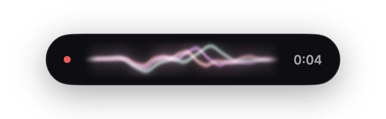
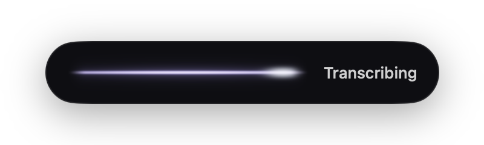
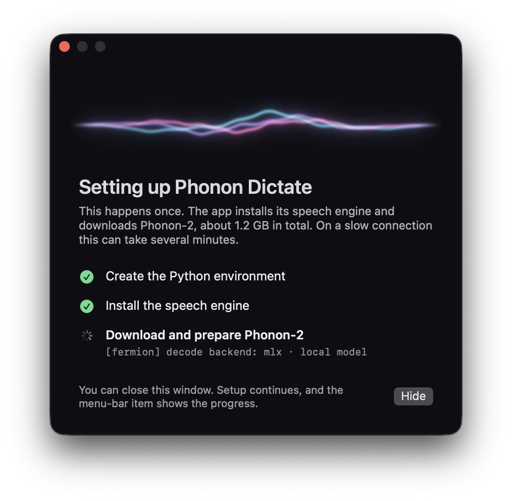

<div align="center">

# Phonon Dictate

**Press ⌥Space, talk, press ⌥Space again. The text is on your clipboard.**

On-device dictation for the Mac, powered by [Phonon-2](https://huggingface.co/FermionResearch/Phonon-2).

[](#requirements)
[](#requirements)
[](Package.swift)
[](https://huggingface.co/FermionResearch/Phonon-2)
[](#privacy)
[](https://github.com/DevMortimer/phonon-dictate/commits/main)
[](LICENSE)




</div>

---

## Features

- **One shortcut.** ⌥Space starts and stops recording. Esc cancels. You can change the shortcut in Settings.
- **Live ribbon.** A pill at the bottom of the screen shows a glowing ribbon, drawn by a Metal shader. Low tones swell it, sharp sounds ripple it, and it gets warmer in color as you get louder. When you stop, it flattens into a line while the model works.
- **Clipboard and history.** Every transcript goes to the clipboard and to a searchable history window.
- **Recordings kept.** Each recording is saved as a WAV file, so you can listen to it again.
- **Retention periods.** Recordings and history are deleted after a period you choose (defaults: 7 days and 30 days).
- **Model only in memory while it works.** The model loads when you start recording, so it is ready when you stop. It unloads when the transcript is done. Nothing stays in memory between dictations.
- **One model.** Phonon-2: 164 MB, 5.21 % average word error rate on the Open ASR Leaderboard English sets.
- **Number repair.** Phonon-2 sometimes writes "like 2.8" as "like2 .8". The app repairs that pattern before it copies the text.

## Requirements

- A Mac with Apple silicon and macOS 14 or later
- [uv](https://docs.astral.sh/uv/): `brew install uv`
- Xcode or the Xcode Command Line Tools, to build

## Quick start

```sh
git clone https://github.com/DevMortimer/phonon-dictate.git
cd phonon-dictate
./scripts/build-app.sh --install    # builds the app and copies it to ~/Applications
open ~/Applications/"Phonon Dictate.app"
```

### First launch

The first launch sets up the speech engine by itself. A setup window shows each step and the live output of the running command:

1. The app makes its own Python environment with uv.
2. It installs the pinned packages from `python/requirements.txt` (about 1 GB, mostly PyTorch and MLX).
3. It downloads Phonon-2 (164 MB), checks the download, and compiles the GPU shaders.



You can hide the window; setup continues and the menu-bar item shows the progress. When the window says **Ready to dictate**, press ⌥Space. The first time you dictate, macOS asks for microphone access. If a step fails, the window shows the error, a button to open the setup log, and **Try Again**.

## Usage

| Action | How |
| --- | --- |
| Start recording | ⌥Space |
| Stop and transcribe | ⌥Space |
| Cancel | Esc |
| Copy a recent transcript | Menu-bar item → Recent |
| Search all transcripts | Menu-bar item → History… |
| Listen to a recording | History → Show Recording |

## Settings

Open **Settings…** from the menu-bar item.

| Setting | Choices | Default |
| --- | --- | --- |
| Shortcut | Any key with ⌃ ⌥ ⇧ or ⌘, or a function key | ⌥Space |
| Keep recordings | 1, 7, 30, 90, 365 days, or forever | 7 days |
| Keep history | 1, 7, 30, 90, 365 days, or forever | 30 days |
| Launch at login | On or off | Off |

## Privacy

All recording and transcription happen on your Mac. The app connects to the internet only during the first launch, to download the Python packages from PyPI and the model from Hugging Face. After setup, the worker runs with `HF_HUB_OFFLINE=1`.

## Files

Everything is in `~/Library/Application Support/Phonon Dictate/`:

| Path | Content |
| --- | --- |
| `recordings/*.wav` | 16 kHz mono recordings |
| `history.json` | Transcripts |
| `python/` | The Python environment |
| `setup.log` | Log of the first-launch setup |
| `worker.log` | Log of each transcription |

The model files are in `~/.cache/fermion/`.

## How it works

```
⌥Space ──► Recorder (AVAudioEngine, 16 kHz WAV) ──► overlay waveform
   │
   └─────► worker.py starts and loads Phonon-2 while you speak
⌥Space ──► WAV path sent to the worker ──► text ──► clipboard + history
                                            └──► worker exits, model unloads
```

- `Sources/PhononDictate/`: the Swift app. Carbon global hotkey, recorder, overlay panel, menu-bar item, settings, and history.
- `python/worker.py`: a one-shot worker. It loads Phonon-2 through the [`fermion-research`](https://pypi.org/project/fermion-research/) package, reads one WAV path from stdin, prints one JSON line, and exits.
- `Sources/PhononDictate/Ribbon.swift`: the ribbon shader. The recorder splits each audio buffer into low, mid, and high bands with an FFT (Accelerate), and the shader turns them into motion and color.

## Development

```sh
swift build                                   # debug build
python3 -m unittest discover -s python        # worker tests
./scripts/build-app.sh                        # app bundle
```

## Troubleshooting

| Problem | Fix |
| --- | --- |
| The menu says the shortcut is used by another app | Choose a different shortcut in Settings. |
| No microphone prompt appears | Run `tccutil reset Microphone com.devmortimer.PhononDictate`, then dictate again. |
| "Transcription failed" | Read `worker.log`. |
| The setup window shows "Setup stopped" | Click **Open Setup Log**, fix the cause, then click **Try Again**. |

## Uninstall

```sh
rm -rf ~/Applications/"Phonon Dictate.app" ~/Library/Application\ Support/Phonon\ Dictate ~/.cache/fermion
defaults delete com.devmortimer.PhononDictate
```

## License

[MIT](LICENSE) for the code in this repository.

## Credits

- [Phonon-2](https://huggingface.co/FermionResearch/Phonon-2) by FermionResearch. Weights: CC-BY-4.0. Based on [NVIDIA parakeet-tdt-0.6b-v3](https://huggingface.co/nvidia/parakeet-tdt-0.6b-v3).
- [`fermion-research`](https://github.com/fermionresearch/phonon): Apache 2.0.
